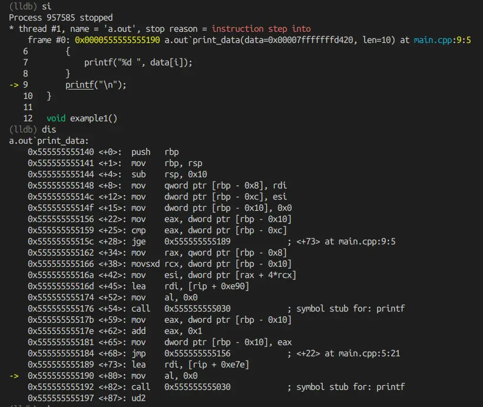
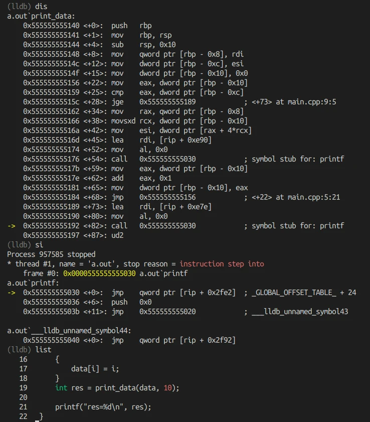

# Analysis of missing return value for non-void function

## Preparation
Let's analysis why there is "crash" when missing return value for non-void function.
- OS: ubuntu 22.04
- Compiler: Clang 15.0.7
- Code: based on main.cpp
- Analysis method: 
    - build and run main.cpp twice, first is missing return, second is with return
    - compare disassembly code
- Conclusion:
    - an `ud2` instruction is generated and being executed.

## First run
```cpp
#include <stdio.h>

int print_data(int* data, int len)
{
    for (int i = 0; i < len; i++)
    {
        printf("%d ", data[i]);
    }
    printf("\n");
    // here the return value is missing
}
```

```bash
clang++ main.cpp
objdump -d a.out > 1.txt
```

## Second run
```cpp
#include <stdio.h>

int print_data(int* data, int len)
{
    for (int i = 0; i < len; i++)
    {
        printf("%d ", data[i]);
    }
    printf("\n");
    return 233; // here we add return statement
}
```

```bash
clang++ main.cpp
objdump -d a.out > 2.txt
```

## Disassembly and compare


We see function epilogue is missing when missing return statement (1.txt, the left part of the image).

The prologue and epilogue for a function should match, i.e. "keep balanced stack".

The function prologue is:
```asm
    1140:	55                   	push   %rbp
    1141:	48 89 e5             	mov    %rsp,%rbp
    1144:	48 83 ec 10          	sub    $0x10,%rsp
```
which decrease the stack by 16 (`sub $0x10, %rsp`), the expected function epilogue should add it back.

## Use LLDB with disassembly
```bash
clang++ main.cpp -g
```
The `-g` keeps debug symbols, which contains source code line number.

The key commands that I use in LLDB:
- `si`: step into next instruction
- `dis`: disassembly





After executing calling printf by `call 0x555555555030`, we still execute `si`, which executes `ud2`.
**ud2** means "Raise invalid opcode exception":
- https://www.felixcloutier.com/x86/ud
- https://learn.microsoft.com/en-us/cpp/intrinsics/ud2?view=msvc-170#:~:text=Generates%20an%20undefined%20instruction.%20Syntax%20C%20void%20__ud2,function%20is%20equivalent%20to%20the%20UD2%20machine%20instruction.


```lldb
    0x555555555190 <+80>: mov    al, 0x0
->  0x555555555192 <+82>: call   0x555555555030            ; symbol stub for: printf
    0x555555555197 <+87>: ud2    
(lldb) si
Process 957585 stopped
* thread #1, name = 'a.out', stop reason = instruction step into
    frame #0: 0x0000555555555030 a.out`printf
a.out`printf:
->  0x555555555030 <+0>:  jmp    qword ptr [rip + 0x2fe2]  ; _GLOBAL_OFFSET_TABLE_ + 24
    0x555555555036 <+6>:  push   0x0
    0x55555555503b <+11>: jmp    0x555555555020            ; ___lldb_unnamed_symbol43

a.out`___lldb_unnamed_symbol44:
    0x555555555040 <+0>:  jmp    qword ptr [rip + 0x2f92]
```