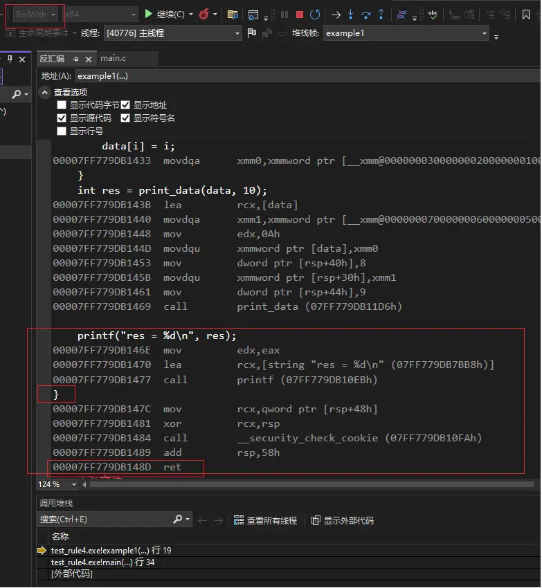

The MSVC compiler with C code that missing return value, inspected disassembly in RelWithDebInfo build type:



Corresponding code:
```c
#include <stdio.h>

int hello()
{
    return 233;
}

int print_data(int* data, int len)
{
    for (int i = 0; i < len; i++)
    {
        printf("%d ", data[i]);
    }
    printf("\n");
    // hello();
}

void example1()
{
    int data[10];
    for (int i = 0; i < 10; i++)
    {
        data[i] = i;
    }
    int res = print_data(data, 10);

    printf("res = %d\n", res);
}

int main()
{
    example1();

    return 0;
}

```


## Pure-command-line
Enter x64 Native Tools Command Prompt windows,

```bash
cd build
dumpbin /DISASM RelWithDebInfo\test_rule4.exe > 1.asm
```
